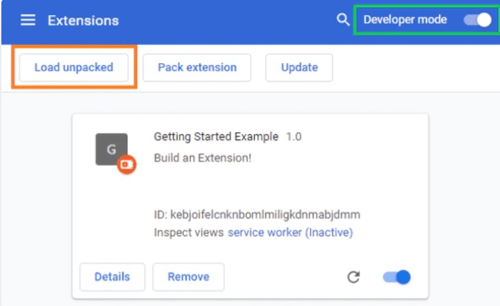
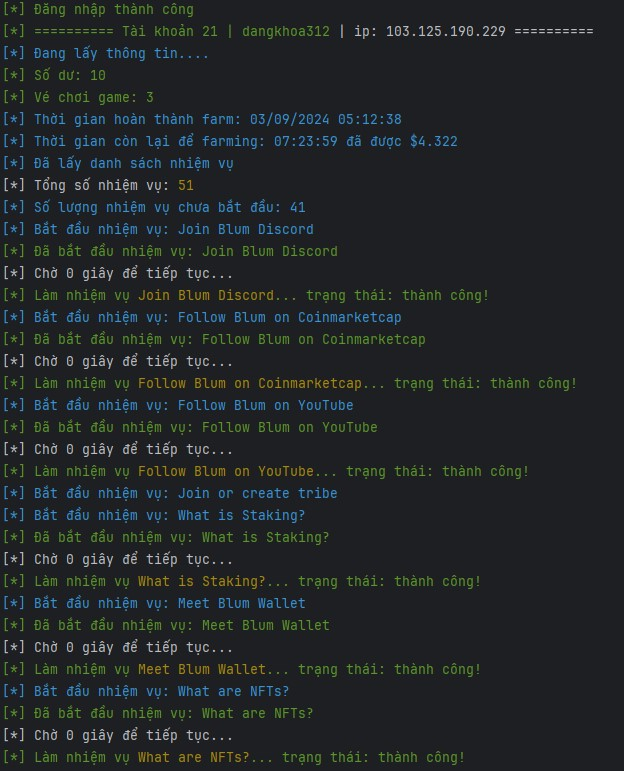
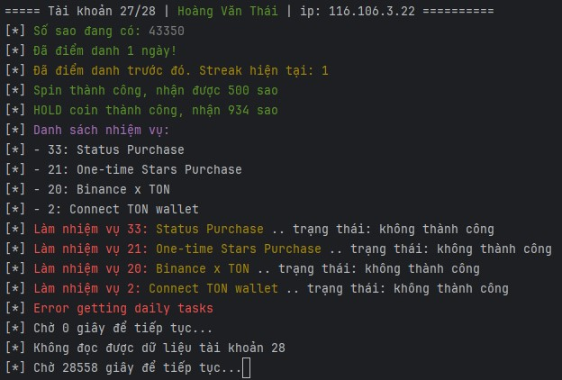
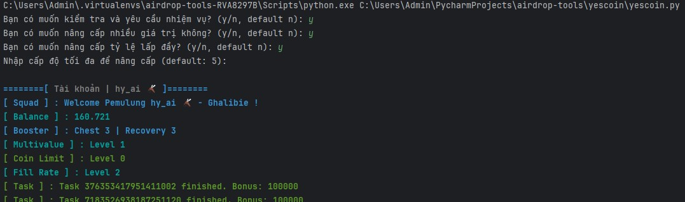
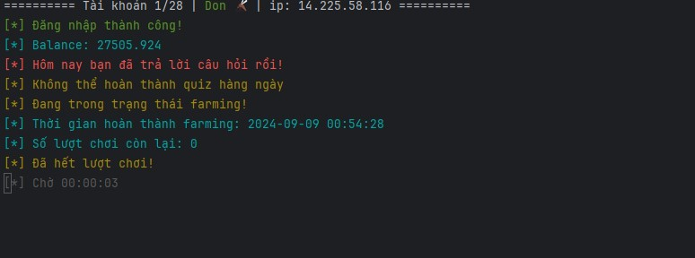
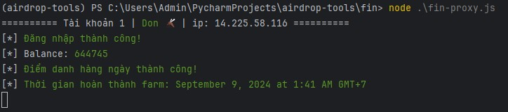

# Airdrop-tools

Airdrop tools for all telegram bot

Join telegram group and ask for support : [](https://t.me/vp_airdrop)

Click the link below to join the bot app and get the referral link:

✅ [Blum](https://t.me/blum/app?startapp=ref_KWlM6oGLsY)

✅ [Major](https://t.me/major/start?startapp=399199645)

✅ [Memefi](https://t.me/memefi_coin_bot/main?startapp=r_ee93f6aea4)

✅ [CZPEPE](https://t.me/czpepeBot?start=399199645)

✅ [Cats](t.me/catsgang_bot/join?startapp=iCkXghxaEvb_qo6M_CNEy)

✅ [Nomis](https://t.me/NomisAppBot/app?startapp=ref_8hl9ssTJVK)

✅ [Fintopio](https://t.me/fintopio/wallet?startapp=reflink-reflink_XP3STJDYcKqYmduP-)

✅ [Banana](https://t.me/OfficialBananaBot/banana?startapp=referral=TCJMSB)

✅ [Matchain](https://t.me/MatchQuestBot/start?startapp=95c2d862b8f59dea782f41aaf4c364ab)

✅ [MoonbergAI](https://t.me/moonbergai_bot/join?startapp=nlMsKP0ZWe)

✅ [WhiteBunny](https://t.me/whitebunnywtf_bot?start=ref66d6ffa67fae5fc4caea3dbf)

✅ [Xkucoin](https://t.me/xkucoinbot/kucoinminiapp?startapp=cm91dGU9JTJGdGFwLWdhbWUlM0ZpbnZpdGVyVXNlcklkJTNEMzk5MTk5NjQ1JTI2cmNvZGUlM0Q=)

✅ [RockyRabbit](https://t.me/rocky_rabbit_bot/play?startapp=frId399199645)

✅ [Yescoin](https://t.me/theYescoin_bot/Yescoin?startapp=mxRCHl)

✅ [Agent301](https://t.me/Agent301Bot/app?startapp=onetime399199645)

✅ [BOINK](https://t.me/boinker_bot/boinkapp?startapp=boink399199645)

✅ [To The Moon](https://t.me/PoPPtothemoon_bot/moon?startapp=399199645)


## Set up
Required: Node.js and Python

1. Create data directory in `{ROOT_REPO}/data`

2. Install extension `{ROOT_REPO}/bypasstele` into your web browser:

`settings` -> `extensions` -> `Developer mode ON` -> `Load unpacked` -> select `{ROOT_REPO}/bypasstele` folder



3. Create data file in `{ROOT_REPO}/data/blum.txt` with format 
`query_id=xxxx or user=xxxx`. Get `query_id` or `user` from the bot app


4. Optional: create proxy file in `{ROOT_REPO}/data/proxy.txt`  with format `http://username:password@ip:port` or `ip:port:username:password`

## Run

### Blum

```sh
cd blum
npm install
node blum.js

// or node blum-proxy.js for proxy
```


This is the same for Major, CZPEPE, Cats, Nomis, Fintopio, Banana, Matchain, Moonbergai

### Major

```sh
cd major
npm install
node major.js

// or node major-proxy.js for proxy
```


### Yescoin

```sh
cd yescoin
npm install
node yes.js
```


### Matchain

```sh
cd matchain
npm install
node mat-proxy.js
```


### Fintopio

```sh
cd fin
npm install
node fin-proxy.js
```


## Contact

[](https://t.me/bxdoan)
[](https://twitter.com/bxdoan)
[](mailto:hi@bxdoan.com)

## Thanks for use
Buy me a coffee

[](https://www.buymeacoffee.com/bxdoan)
[](https://etherscan.io/address/0x610322AeF748238C52E920a15Dd9A8845C9c0318)
[](https://paypal.me/bxdoan)
